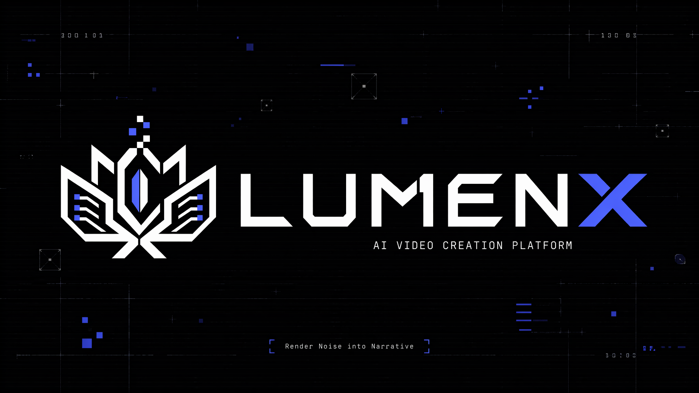

<!-- Banner -->
<div align="center">
  
</div>

<div align="center">

# PrismReel

### AI-Native Motion Comic & Video Creation Platform
**Render Noise into Narrative**

[](LICENSE)
[](https://www.python.org/)
[](https://nodejs.org/)
[](https://github.com/Zwens/prismreel)

[English](README_EN.md) · [中文](README.md) · [Changelog](CHANGELOG.md) · [Contributing](CONTRIBUTING.md)

</div>

---

PrismReel is an **AI-native motion comic & video creation platform**. It transforms creative text into publishable dynamic videos, providing a complete workflow from script analysis to final export, while also supporting standalone image/video generation.

PrismReel currently includes three core modules:

| Module | Purpose |
|--------|---------|
| **PrismReel Studio** | Pipeline-first comic/video production (Script → Storyboard → Assets → Video → Export) |
| **PrismReel Playground** | Standalone image/video generation workbench (no project context required) |
| **AI Video** | One-shot video page limited to T2V / I2V / V2V, drawing on assets that already exist in the app |

---

## ✨ Core Capabilities

<table>
<tr>
<td width="50%">

### 🎬 Studio — Full Pipeline Production

- **Deep Script Analysis** — LLM auto-extracts characters/scenes/props, generates structured storyboards
- **Art Direction Control** — Custom visual styles with global consistency
- **Multi-model Asset Generation** — Character turnarounds, scene establishing shots, prop references
- **AI Video Generation** — I2V / R2V multi-mode video generation + batch candidates
- **Smart Dubbing** — Gemini TTS with 30 voices; delivery is steered by a natural-language style directive
- **One-click Export** — Timeline editing + FFmpeg merging

</td>
<td width="50%">

### 🎨 Playground — Standalone Generation Workbench

- **6 Generation Modes** — T2I / I2I / T2V / I2V / R2V / V2V
- **13 Model Lines** — Nano Banana Pro / 2 / 2 Lite, Seedance 2.5 / 2.0 / 2.0 Fast / 2.0 Mini, Kling V3, Vidu Q3 Pro / Turbo / Drama, Vidu Q3 Fast / Lite Image
- **Dynamic Parameters** — Per-model parameter configuration (size/resolution/duration/quality)
- **Concurrent Tasks** — Multiple tasks execute simultaneously with real-time status tracking
- **Prompt Templates** — Save/reuse/favorite/history
- **Gallery View** — Grid/gallery toggle + detail panel

</td>
</tr>
</table>

---

## 🎨 v1.2.1 Visual Identity Refresh

<div align="center">

| Before | After |
|:---:|:---:|
|  |  |
| Neon gradient lotus · Soft curves | Cyber Brutalism · Angular geometry · Circuit textures |

</div>

---

## 📸 Screenshots

<div align="center">

| Studio Storyboard | Playground |
|:---:|:---:|
|  |  |

</div>

---

## 🎯 Supported AI Models

| Provider | Models | Capabilities |
|----------|--------|--------------|
| **Google Gemini** | Nano Banana 2 `gemini-3.1-flash-image` — default image model | T2I, I2I |
| **Google Gemini** | Nano Banana Pro `gemini-3-pro-image` | T2I, I2I |
| **Google Gemini** | Nano Banana 2 Lite `gemini-3.1-flash-lite-image` | T2I, I2I |
| **Google Gemini** | Gemini 3.8 Flash (falls back to 3.5 / 2.5 Flash) | Script Analysis, Prompt Polish |
| **Google Gemini** | `gemini-3.1-flash-tts-preview` — 30 voices | TTS Dubbing |
| **BytePlus ModelArk** | Seedance 2.5 — default I2V / R2V model | T2V, I2V, R2V, V2V<sup>†</sup> |
| **BytePlus ModelArk** | Seedance 2.0 / 2.0 Fast / 2.0 Mini | T2V, I2V, R2V |
| **Kling Direct** | Kling V3 | I2V, R2V |
| **Vidu Direct** | Vidu Q3 Pro / Turbo / Drama | I2V, R2V |
| **Vidu Direct** | Vidu Q3 Fast Image / Lite Image | T2I, I2I |

<sup>†</sup> Seedance 2.5 V2V (edit / extend) is wired up at runtime but still marked `hidden` in the catalog, so it does not appear in the model picker by default.

> Since the Gemini + Ark migration, DashScope is gone from the model layer entirely; Kling and Vidu no longer have a proxy backend and require vendor credentials.

---

## 🚀 Quick Start

### Prerequisites

- Python 3.11+
- Node.js 18+
- FFmpeg (for video processing)

### One-command Launch

```bash
# Clone
git clone https://github.com/Zwens/prismreel.git
cd prismreel

# Configure API Key
cp .env.example .env
# Edit .env, fill in GEMINI_API_KEY (required); add ARK_API_KEY for video generation

# Start (backend on 17177 + frontend on 3008, auto-opens browser)
npm run dev
```

Or start separately:

```bash
# Backend
pip install -r requirements.txt
./start_backend.sh  # http://localhost:17177

# To run the backend test suite, install the dev extras (pytest, ...)
pip install -r requirements-dev.txt && pytest

# Frontend
cd frontend && npm install && npm run dev  # http://localhost:3008
```

### Access

- **Studio**: http://localhost:3008
- **Playground**: http://localhost:3008/#/playground
- **AI Video**: http://localhost:3008/#/ai-video
- **API Docs**: http://localhost:17177/docs

---

## ⚙️ Configuration Modes

PrismReel uses a **local-first** architecture. The minimal setup requires only one API key.

| Mode | Required | Available Capabilities |
|------|----------|----------------------|
| **Basic** | `GEMINI_API_KEY` | Script analysis / prompt polish + image generation (Nano Banana) + TTS dubbing |
| **+ BytePlus ModelArk** | + `ARK_API_KEY` | + Seedance 2.5 / 2.0 / 2.0 Fast / 2.0 Mini video generation |
| **+ Kling Direct** | + `KLING_ACCESS_KEY` + `KLING_SECRET_KEY` | + Kling V3 video generation |
| **+ Vidu Direct** | + `VIDU_API_KEY` | + Vidu Q3 video and image generation |
| **+ OSS** | + Alibaba Cloud OSS credentials | Cloud media mirror + signed URLs |

<details>
<summary>Detailed Configuration</summary>

All settings can be configured via:
- **Development**: `.env` file in project root
- **In-app Settings**: Settings page (saves to `~/.prismreel/config.json`)

BytePlus ModelArk's `ARK_API_KEY` only grants access; you must also activate the Seedance models in the ModelArk console, or calls will return a 404 error.

</details>

---

## 🏗️ Architecture

<div align="center">
  
</div>

### Directory Structure

```
prismreel/
├── frontend/                  # Next.js Frontend
│   └── src/components/
│       ├── modules/playground/   # Playground module
│       ├── modules/              # Studio business modules
│       └── layout/               # Global layout
├── src/
│   ├── apps/comic_gen/        # Studio backend (API + Pipeline)
│   ├── apps/playground/       # Playground backend (API + Service)
│   ├── models/                # AI model adapters (Gemini/Kling/Vidu/BytePlus)
│   └── audio/                 # TTS voice synthesis
├── config/model_catalog/      # Model catalog (YAML → JSON)
└── output/                    # Generated outputs (local storage)
```

---

## 📖 Documentation

| Document | Description |
|----------|-------------|
| [User Manual](USER_MANUAL.md) | Feature usage guide |
| [API Docs](http://localhost:17177/docs) | Swagger UI |
| [Model Onboarding](docs/model-onboarding-implementation.md) | New model integration guide |
| [Catalog Architecture](docs/plans/2026-04-03-model-docs-and-catalog-architecture.md) | Model catalog design |
| [Playground PRD](docs/plans/2026-06-06-playground-standalone-generation-prd.md) | Playground design document |

---

## 🤝 Contributing

Contributions are welcome! Please read our [Contributing Guide](CONTRIBUTING.md).

- **Bug Reports**: [GitHub Issues](https://github.com/Zwens/prismreel/issues)
- **Feature Requests**: [GitHub Discussions](https://github.com/Zwens/prismreel/discussions)

---

## 📄 License

[MIT License](LICENSE)

---

<div align="center">
  Made with ❤️ by Zwens
</div>
